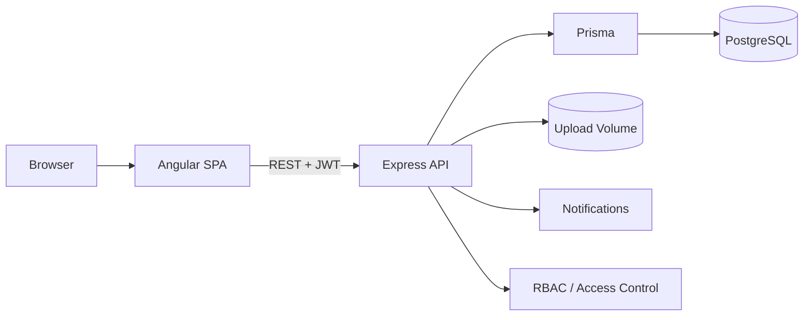

# ProjectFlow Enterprise

> Portfolio-grade project management platform built with **Angular 19 + Node.js/Express + PostgreSQL + Prisma**, packaged as a reproducible Docker application.

[](https://github.com/YOUR_USERNAME/projectflow-enterprise/actions/workflows/ci.yml)

## Why this project

ProjectFlow demonstrates a realistic full-stack application rather than a CRUD-only demo. It combines authentication, role-based authorization, project/task workflows, collaboration, file handling, analytics, containerization, and continuous integration in one codebase.

## Feature set

- 🔐 JWT authentication and protected API routes
- 👥 RBAC: **Admin, Manager, Developer**
- 📁 Project and membership management
- 📋 Kanban board with drag-and-drop ordering
- 📝 Tasks, priorities, due dates, and assignments
- 💬 Task comments
- 📎 File attachments
- 🔔 In-app notifications
- 📊 Project analytics
- 🐘 PostgreSQL + Prisma ORM
- 🐳 Docker + Docker Compose
- ❤️ Health endpoint
- ⚙️ GitHub Actions CI
- 📚 Architecture, API, deployment, security, and interview documentation

## Tech stack

| Layer | Technology |
|---|---|
| Frontend | Angular 19, TypeScript, Angular CDK, RxJS |
| Backend | Node.js 22, Express |
| Database | PostgreSQL 16 |
| ORM | Prisma 6 |
| Auth | JWT + bcrypt |
| Uploads | Multer + persistent Docker volume |
| DevOps | Docker, Docker Compose, GitHub Actions |

## Architecture



See [`docs/ARCHITECTURE.md`](docs/ARCHITECTURE.md) for the detailed design.

## Run with one command

### Prerequisites

- Docker Desktop
- Git

Clone the repository and run:

```bash
git clone https://github.com/YOUR_USERNAME/projectflow-enterprise.git
cd projectflow-enterprise
docker compose up --build
```

Open **http://localhost:8080**.

The first startup automatically builds Angular, generates Prisma Client, creates the PostgreSQL schema, seeds a local admin account, and starts the application.

### Demo account

Default local credentials:

```text
Email:    admin@projectflow.dev
Password: Admin@123
```

These are **demo-only defaults**. Override `SEED_ADMIN_EMAIL` and `SEED_ADMIN_PASSWORD` for any shared or public deployment.

### Reset the demo

```bash
docker compose down -v
docker compose up --build
```

The `-v` removes the local PostgreSQL and attachment volumes.

## Local development without the full app container

Start PostgreSQL:

```bash
docker compose up postgres -d
```

Backend:

```bash
cd server
cp .env.example .env
npm install
npx prisma db push
npm run seed
npm run dev
```

Frontend:

```bash
cd client
npm install
npm start
```

Then use:

- Frontend: http://localhost:4200
- API: http://localhost:3000/api

## API

See [`docs/API.md`](docs/API.md) for the endpoint catalog.

Health check:

```bash
curl http://localhost:8080/api/health
```

## Screenshots

The application UI includes:

- Overview dashboard
- Project list
- Kanban project board
- Task collaboration modal
- Analytics view
- Admin role management

After the first local run, capture screenshots into `docs/screenshots/` and reference them here. Keeping screenshots generated from the actual build avoids documenting a UI that differs from the deployed version.

## Security and production notes

This repository is a portfolio/demo application. Before production deployment:

- Use a long random `JWT_SECRET`.
- Store secrets in a platform secret manager.
- Use HTTPS.
- Restrict `CLIENT_ORIGIN`.
- Use managed PostgreSQL.
- Move attachments to private object storage.
- Add rate limiting and stronger upload validation.
- Add structured audit logs, metrics, tracing, and dependency/container scanning.

See [`docs/SECURITY.md`](docs/SECURITY.md) and [`docs/DEPLOYMENT.md`](docs/DEPLOYMENT.md).

## CI/CD

GitHub Actions runs on pushes and pull requests to `main` and:

1. installs server dependencies,
2. generates Prisma Client,
3. installs frontend dependencies,
4. builds Angular,
5. validates the Docker image.

Workflow: [`.github/workflows/ci.yml`](.github/workflows/ci.yml)

## Portfolio / interview material

[`docs/PORTFOLIO_TALKING_POINTS.md`](docs/PORTFOLIO_TALKING_POINTS.md) covers architecture decisions and questions you can discuss in interviews.

## License

MIT — see [`LICENSE`](LICENSE).
